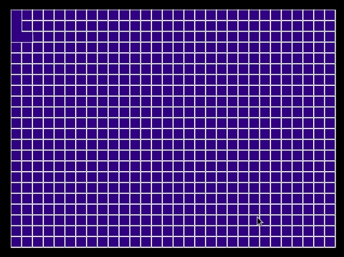
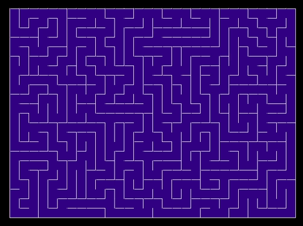

# Maze

Maze generated with an iterative DFS solution<br>

</br>

Yellow dots represents BFS to find the bottom right corner. Purple path represents path from start (top-left) to end of maze. 



To Run:

1. You will need the SDL2 library [installed](https://wiki.libsdl.org/Installation).
2. Inside the terminal run ```make```. (Note: I developed this on  a linux system so you may need to configure your terminal on Windows) 

When you Maze Generator Window appears, enter 'g' on your keyboard to generate the maze, then enter 's' for the maze path to appear.
